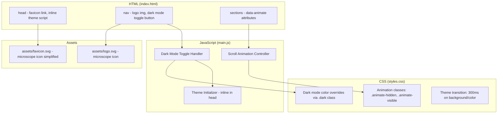
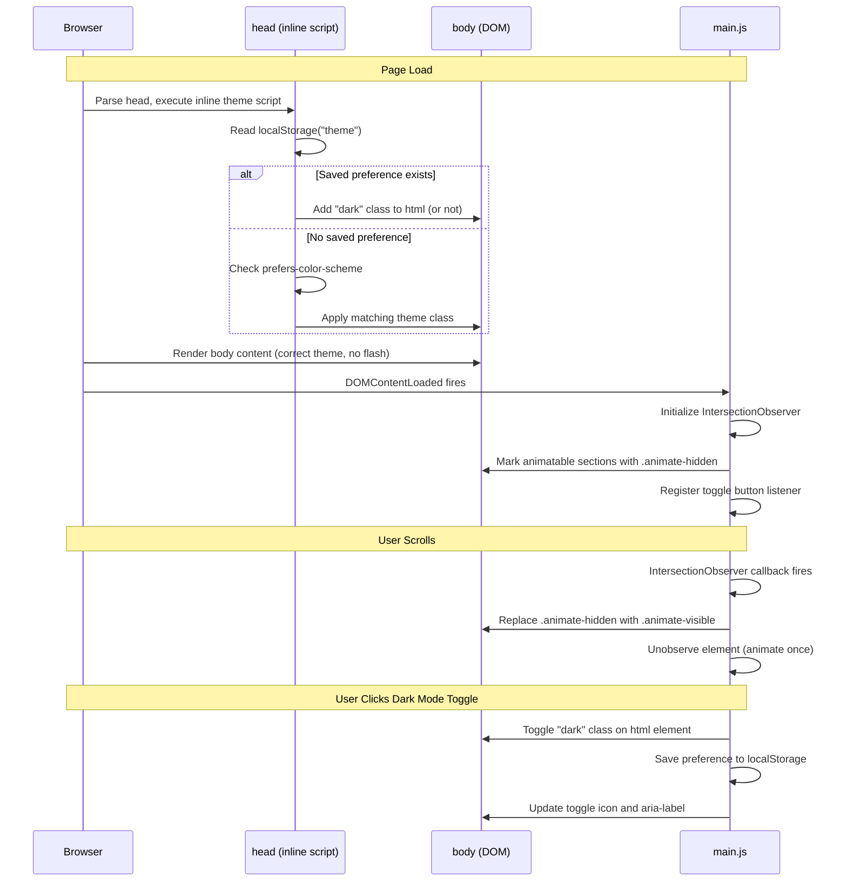
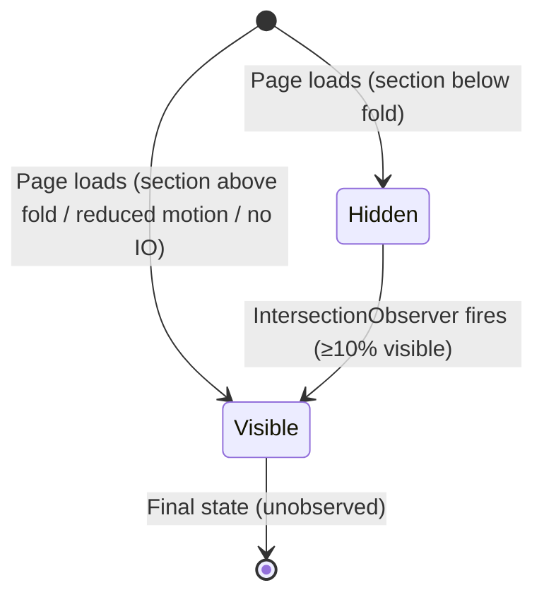

# Design Document: Landing Page Enhancements

## Overview

This design covers four enhancements to the existing PetroScientific static landing page: a new microscope icon SVG logo, a matching favicon, scroll-triggered animations using IntersectionObserver, and a dark mode toggle with localStorage persistence.

The landing page is a static vanilla HTML/CSS/JS site using Tailwind CSS via CDN. There is no build step or framework involved. All changes will be made directly to the existing files (`index.html`, `styles.css`, `main.js`) and the `assets/` directory.

### Design Decisions

| Decision | Choice | Rationale |
|----------|--------|-----------|
| Animation API | IntersectionObserver | Native browser API, no library needed, performant |
| Dark mode mechanism | Tailwind `dark:` variant via `class` strategy | Works with CDN Tailwind, no build config needed |
| Theme persistence | localStorage | Simple, synchronous read available for flash prevention |
| Flash prevention | Inline `<script>` in `<head>` | Executes before body renders, prevents FOUC |
| Favicon format | SVG | Scalable, small file size, matches logo format |
| Animation trigger | CSS class toggle | GPU-accelerated via transform/opacity, no JS animation frames |

## Architecture



### Component Interaction Flow



## Components and Interfaces

### 1. Logo SVG (`assets/logo.svg`)

The existing `logo.svg` will be replaced with a new version containing a microscope icon in the left 42px area. The SVG retains the same viewBox (200x50), brand colors, and text elements.

**Structure:**
- Microscope icon (eyepiece, body tube, stage, base) positioned at x: 0–42
- "PetroScientific" text at x: 52
- "Quality Control Services" tagline at x: 52

### 2. Favicon SVG (`assets/favicon.svg`)

A new simplified microscope icon SVG optimized for small display sizes (16x16, 32x32).

**Constraints:**
- Square viewBox (e.g., `0 0 32 32`)
- File size ≤ 10KB
- Uses brand primary color (#1e3a5f) on transparent background

### 3. Scroll Animation Controller (in `main.js`)

```javascript
/**
 * Initializes scroll-triggered animations using IntersectionObserver.
 * Sections with [data-animate] attribute will fade in when 10% visible.
 * Respects prefers-reduced-motion and gracefully degrades without IO support.
 */
function initScrollAnimations() { ... }
```

**Interface:**
- Reads: `[data-animate]` attribute on section elements
- Applies: `.animate-hidden` class initially, replaces with `.animate-visible` on intersection
- Configuration: `threshold: 0.1`, animate once (unobserve after trigger)
- Graceful degradation: If `IntersectionObserver` is undefined or `prefers-reduced-motion: reduce` is active, all sections remain in final visible state

### 4. Dark Mode Toggle (in `main.js`)

```javascript
/**
 * Initializes the dark mode toggle button.
 * Handles click/keyboard events, updates icon, persists preference.
 */
function initDarkModeToggle() { ... }

/**
 * Resolves the initial theme based on priority:
 * 1. localStorage saved preference
 * 2. prefers-color-scheme media query
 * 3. Default: "light"
 * @returns {"light" | "dark"}
 */
function resolveTheme() { ... }

/**
 * Applies the given theme by toggling the "dark" class on <html>.
 * Updates the toggle button icon and aria-label.
 * @param {"light" | "dark"} theme
 */
function applyTheme(theme) { ... }

/**
 * Persists the theme preference to localStorage.
 * Silently fails if localStorage is unavailable.
 * @param {"light" | "dark"} theme
 */
function saveThemePreference(theme) { ... }
```

### 5. Inline Theme Initialization Script (in `<head>`)

A small inline `<script>` block in the HTML `<head>` that runs synchronously before body rendering:

```javascript
// Prevents flash of wrong theme
(function() {
  try {
    var theme = localStorage.getItem('ps-theme');
    if (!theme) {
      theme = window.matchMedia('(prefers-color-scheme: dark)').matches ? 'dark' : 'light';
    }
    if (theme === 'dark') {
      document.documentElement.classList.add('dark');
    }
  } catch (e) {
    // localStorage unavailable, fall back to system preference
    if (window.matchMedia('(prefers-color-scheme: dark)').matches) {
      document.documentElement.classList.add('dark');
    }
  }
})();
```

### 6. CSS Additions (`styles.css`)

```css
/* Scroll animation states */
.animate-hidden {
  opacity: 0;
  transform: translateY(20px);
}

.animate-visible {
  opacity: 1;
  transform: translateY(0);
  transition: opacity 0.6s ease-out, transform 0.6s ease-out;
}

/* Dark mode color scheme */
.dark body { ... }
.dark nav { ... }
/* etc. */

/* Theme transition */
body {
  transition: background-color 0.3s ease, color 0.3s ease;
}
```

## Data Models

### Theme Preference (localStorage)

| Key | Value | Description |
|-----|-------|-------------|
| `ps-theme` | `"light"` \| `"dark"` | User's selected theme preference |

### Theme Resolution Priority

```
1. localStorage.getItem("ps-theme")  →  "light" | "dark" | null
2. matchMedia("(prefers-color-scheme: dark)").matches  →  true | false
3. Default  →  "light"
```

### Animation State Machine



Each animatable section transitions through:
- **Hidden**: `opacity: 0`, `translateY(20px)` — occupies layout space
- **Visible**: `opacity: 1`, `translateY(0)` — final rendered state

## Correctness Properties

*A property is a characteristic or behavior that should hold true across all valid executions of a system — essentially, a formal statement about what the system should do. Properties serve as the bridge between human-readable specifications and machine-verifiable correctness guarantees.*

### Property 1: Theme toggle idempotence

*For any* initial theme state (light or dark), toggling the dark mode switch twice SHALL return the page to its original theme state.

**Validates: Requirements 4.2**

### Property 2: Theme persistence round-trip

*For any* theme value ("light" or "dark"), saving it to localStorage via the toggle and then calling the theme resolution function SHALL return the same theme value that was saved.

**Validates: Requirements 4.4, 4.5**

## Error Handling

| Scenario | Handling Strategy |
|----------|-------------------|
| `IntersectionObserver` not supported | All sections displayed in final visible state immediately (no animation) |
| `prefers-reduced-motion: reduce` active | All sections displayed in final visible state immediately (no animation) |
| `localStorage` unavailable (private browsing, quota exceeded) | Theme toggle works for current session only; falls back to `prefers-color-scheme` on load |
| `localStorage.getItem` throws | Caught in try/catch; falls back to system preference |
| `localStorage.setItem` throws | Caught in try/catch; toggle still works visually for current session |
| Invalid value in `localStorage("ps-theme")` | Treat as no saved preference; fall back to system preference |
| SVG logo fails to load | `` alt text "PetroScientific Quality Control Services logo" displayed as fallback |
| Favicon SVG not supported by browser | Browser shows default/no favicon (graceful degradation) |

## Testing Strategy

### Unit Tests (Vitest + jsdom)

The project already uses Vitest. Unit tests will cover:

- **Theme resolution logic**: Test `resolveTheme()` with various localStorage/matchMedia states
- **Theme persistence**: Test `saveThemePreference()` writes correct value to localStorage
- **Toggle behavior**: Test that toggling updates the `dark` class on `<html>` and updates aria-label
- **Scroll animation initialization**: Test that `initScrollAnimations()` creates IntersectionObserver with correct options
- **Graceful degradation**: Test behavior when IntersectionObserver is undefined
- **Reduced motion**: Test that animations are skipped when prefers-reduced-motion matches
- **localStorage failure**: Test fallback behavior when localStorage throws

### Property-Based Tests (fast-check)

Property-based testing applies to the dark mode toggle logic, which has clear input/output behavior and round-trip properties.

- **Library**: fast-check (already compatible with Vitest)
- **Minimum iterations**: 100 per property test
- **Tag format**: `Feature: landing-page-enhancements, Property {number}: {property_text}`

Property tests to implement:
1. **Theme toggle idempotence**: Generate random initial states, toggle twice, verify return to original
2. **Theme persistence round-trip**: Generate random theme values, save, resolve, verify match

### Static Asset Verification

- SVG logo contains microscope elements and correct viewBox
- Favicon file exists, is SVG format, has square viewBox, and is ≤ 10KB
- HTML contains correct `<link rel="icon">` element
- HTML contains inline theme script in `<head>`

### Manual Testing

- Visual verification of microscope logo at various viewport widths (320px–1920px)
- Favicon appearance in browser tabs across Chrome, Firefox, Safari
- Scroll animation smoothness and timing
- Dark mode color contrast (WCAG AA compliance)
- Reduced motion preference respected
- Theme persistence across page reloads
