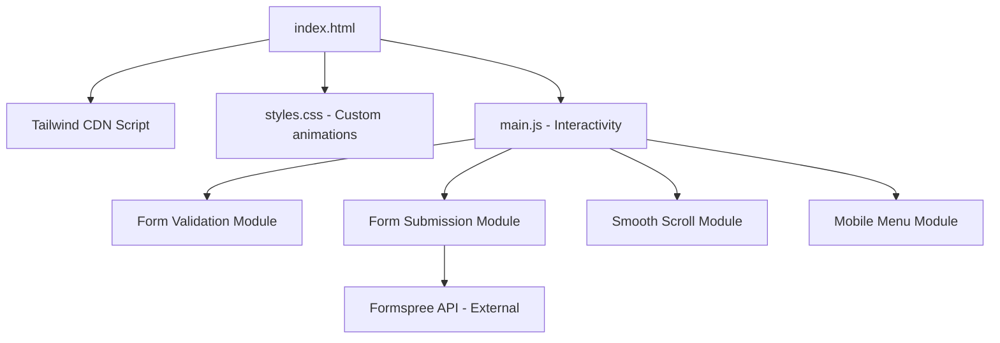
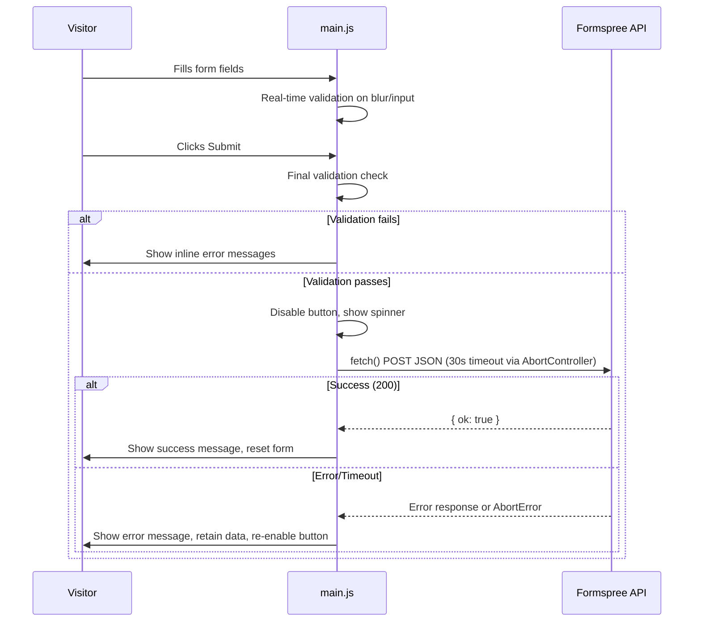

# Design Document: Landing Page SPA

## Overview

This design describes the transformation of the PetroScientific application into a single-page landing page built entirely with vanilla web technologies — no frameworks, no build step, no TypeScript. The existing Angular application with all its features will be completely replaced by a static landing page consisting of a single `index.html` file, a small `styles.css` file for custom animations, and a `main.js` file for interactivity.

The site uses Tailwind CSS loaded via CDN for utility-based styling, and vanilla JavaScript for form validation, Formspree submission (via fetch API), smooth scrolling, and mobile menu toggling. The only interactive element is the inquiry form, which submits data to Formspree via HTTP POST.

### Key Design Decisions

1. **No Framework**: Pure HTML/CSS/JS eliminates build complexity, reduces bundle size to near-zero, and makes the site trivially deployable to any static host.
2. **Tailwind CSS via CDN**: Using the Tailwind CDN play script (`<script src="https://cdn.tailwindcss.com">`) provides full utility class support without a build step. A small custom `styles.css` handles animations and any styles that Tailwind utilities cannot express.
3. **Fetch API for Formspree**: Native `fetch()` with `AbortController` for timeout handling replaces any HTTP client library. JSON submission with `Accept: application/json` header enables AJAX submission without page reload.
4. **No Build Step**: The site works by opening `index.html` directly or serving with any static file server (e.g., `npx serve`, Python's `http.server`, VS Code Live Server).
5. **Progressive Enhancement**: The page is fully readable without JavaScript. JS enhances the experience with smooth scrolling, form validation feedback, and mobile menu toggling.

## Architecture

The application is a flat set of static files with no compilation, bundling, or framework overhead.



### File Structure

```
landing-page/
├── index.html          # Single HTML file with all content sections
├── styles.css          # Custom CSS animations and overrides
├── main.js             # All JavaScript functionality
└── assets/
    └── logo.svg        # Company logo (or logo.png)
```

### Data Flow (Form Submission)



## Components and Interfaces

Since there are no framework components, the "components" are semantic HTML sections within `index.html` and JavaScript modules (functions) within `main.js`.

### HTML Sections

| Section ID | HTML Element | Purpose |
|-----------|-------------|---------|
| `navbar` | `<nav>` | Navigation bar with logo, anchor links, mobile hamburger button |
| `hero` | `<section>` | Hero headline, trust indicators, CTA button |
| `services` | `<section>` | Service offering cards (repair, calibration, spare parts) |
| `why-choose-us` | `<section>` | Company differentiators |
| `inquiry-form` | `<section>` | Contact form with validation |
| `footer` | `<footer>` | Contact info, quick links, legal notices |

### JavaScript Modules (within main.js)

```javascript
// ===== Form Validation =====

/**
 * Validates a single form field and returns an error message or null.
 * @param {HTMLInputElement|HTMLTextAreaElement} field
 * @returns {string|null} Error message or null if valid
 */
function validateField(field) { /* ... */ }

/**
 * Validates the entire form. Returns true if all fields are valid.
 * @param {HTMLFormElement} form
 * @returns {boolean}
 */
function validateForm(form) { /* ... */ }

/**
 * Displays or clears an inline error message for a field.
 * Sets aria-invalid and aria-describedby attributes.
 * @param {HTMLInputElement|HTMLTextAreaElement} field
 * @param {string|null} message
 */
function showFieldError(field, message) { /* ... */ }

// ===== Form Submission =====

/**
 * Submits form data to Formspree via fetch POST.
 * Handles timeout via AbortController (30s).
 * @param {Object} formData - { name, email, phone, company, message }
 * @returns {Promise<{ok: boolean, error?: string}>}
 */
async function submitToFormspree(formData) { /* ... */ }

// ===== Smooth Scrolling =====

/**
 * Scrolls smoothly to the element matching the given selector.
 * @param {string} selector - CSS selector (e.g., '#services')
 */
function scrollToSection(selector) { /* ... */ }

// ===== Mobile Menu =====

/**
 * Toggles the mobile navigation menu open/closed.
 */
function toggleMobileMenu() { /* ... */ }
```

### Form Field Specifications

| Field | HTML Element | Required | Max Length | Validation |
|-------|-------------|----------|-----------|------------|
| Full Name | `<input type="text">` | Yes | 100 | At least 1 non-whitespace character |
| Email | `<input type="email">` | Yes | 254 | Pattern: `local@domain.tld` |
| Phone | `<input type="tel">` | No | 20 | None (optional) |
| Company | `<input type="text">` | No | 100 | None (optional) |
| Message | `<textarea>` | Yes | 2000 | At least 1 non-whitespace character |

## Data Models

Since there is no TypeScript, data models are documented as the expected shape of objects passed between functions.

### Inquiry Form Data (JavaScript object)

```javascript
// Shape of form data submitted to Formspree
const formData = {
  name: "",       // string, max 100 chars, required (non-whitespace)
  email: "",      // string, max 254 chars, required (valid email pattern)
  phone: "",      // string, max 20 chars, optional
  company: "",    // string, max 100 chars, optional
  message: ""     // string, max 2000 chars, required (non-whitespace)
};
```

### Form Validation Constraints

```javascript
const FORM_CONSTRAINTS = {
  name: { maxLength: 100, required: true },
  email: { maxLength: 254, required: true, pattern: /^[^\s@]+@[^\s@]+\.[^\s@]+$/ },
  phone: { maxLength: 20, required: false },
  company: { maxLength: 100, required: false },
  message: { maxLength: 2000, required: true }
};
```

### Formspree Configuration

```javascript
// Formspree endpoint - replace {FORM_ID} with actual form ID
const FORMSPREE_ENDPOINT = "https://formspree.io/f/{FORM_ID}";
const SUBMISSION_TIMEOUT_MS = 30000;
```


## Correctness Properties

*A property is a characteristic or behavior that should hold true across all valid executions of a system — essentially, a formal statement about what the system should do. Properties serve as the bridge between human-readable specifications and machine-verifiable correctness guarantees.*

### Property 1: Whitespace-only strings are rejected for required fields

*For any* string composed entirely of whitespace characters (spaces, tabs, newlines, or combinations thereof), the `validateField` function SHALL return an error message when that string is provided as the value of a required field (name, email, or message), and the form SHALL be considered invalid.

**Validates: Requirements 4.2**

### Property 2: Email validation accepts valid patterns and rejects invalid ones

*For any* string matching the pattern of one-or-more non-whitespace/non-@ characters, followed by `@`, followed by one-or-more non-whitespace/non-@ characters, followed by `.`, followed by one-or-more non-whitespace/non-@ characters, the email validation function SHALL accept it as valid. *For any* string that does NOT match this pattern (missing `@`, missing dot in domain, empty local part, empty domain), the email validation function SHALL reject it as invalid.

**Validates: Requirements 4.3**

### Property 3: Invalid required fields produce accessible error feedback

*For any* required form field (name, email, message) that contains an invalid value (whitespace-only for name/message, invalid pattern for email), the `showFieldError` function SHALL set `aria-invalid="true"` on the field element, display a visible inline error message, and associate that error message with the field via `aria-describedby` pointing to the error element's ID.

**Validates: Requirements 4.4, 6.3**

### Property 4: All form inputs have associated visible labels

*For any* `<input>` or `<textarea>` element within the inquiry form, there SHALL exist a visible `<label>` element whose `for` attribute matches the input's `id` attribute.

**Validates: Requirements 6.2**

### Property 5: All images have appropriate alt text

*For any* `` element in the landing page that conveys meaningful content (e.g., company logo), the `alt` attribute SHALL contain a non-empty descriptive string. *For any* purely decorative `` element, the `alt` attribute SHALL be an empty string (`alt=""`).

**Validates: Requirements 6.7**

## Error Handling

### Form Validation Errors

| Error Condition | User Feedback |
|----------------|---------------|
| Required field empty/whitespace-only | Inline message: "{Field name} is required" |
| Email format invalid | Inline message: "Please enter a valid email address" |
| Field exceeds max length | HTML `maxlength` attribute prevents input beyond limit |

### Submission Errors

| Error Condition | User Feedback | Recovery |
|----------------|---------------|----------|
| Network error | "Unable to submit your inquiry. Please check your connection and try again." | Form data retained, submit button re-enabled |
| Formspree error (4xx/5xx) | "Something went wrong. Please try again later." | Form data retained, submit button re-enabled |
| Request timeout (30s) | "The request timed out. Please try again." | Form data retained, submit button re-enabled |

### Error Implementation Strategy

```javascript
async function submitToFormspree(formData) {
  const controller = new AbortController();
  const timeoutId = setTimeout(() => controller.abort(), SUBMISSION_TIMEOUT_MS);

  try {
    const response = await fetch(FORMSPREE_ENDPOINT, {
      method: "POST",
      headers: {
        "Content-Type": "application/json",
        "Accept": "application/json"
      },
      body: JSON.stringify(formData),
      signal: controller.signal
    });

    clearTimeout(timeoutId);

    if (!response.ok) {
      return { ok: false, error: "Something went wrong. Please try again later." };
    }
    return { ok: true };
  } catch (err) {
    clearTimeout(timeoutId);
    if (err.name === "AbortError") {
      return { ok: false, error: "The request timed out. Please try again." };
    }
    return { ok: false, error: "Unable to submit your inquiry. Please check your connection and try again." };
  }
}
```

Key behaviors:
- `AbortController` with 30-second timeout replaces RxJS timeout operator
- Form data is never cleared on error (the DOM inputs retain their values naturally)
- Submit button is re-enabled on any error to allow retry
- Success resets the form via `form.reset()` and shows a confirmation message

## Testing Strategy

### Approach

Since this is a vanilla HTML/CSS/JS project with no build step, testing can be approached in two ways:

1. **Manual Testing Checklist** — for layout, responsiveness, accessibility, and visual verification
2. **Automated Tests with Vitest + jsdom** (optional) — for validating JavaScript logic (form validation, submission handling) including property-based tests

### Manual Testing Checklist

- [ ] Page loads without JavaScript errors in console
- [ ] All sections render in correct order (nav, hero, services, why-choose-us, form, footer)
- [ ] Navigation anchor links smooth-scroll to correct sections
- [ ] Mobile menu toggles open/closed on hamburger click (< 768px)
- [ ] Responsive layout: single-column on mobile, two-column services on tablet, three-column on desktop
- [ ] No horizontal scrollbar at 320px viewport width
- [ ] Form validation: required fields reject whitespace-only input
- [ ] Form validation: email field rejects invalid patterns
- [ ] Form submission: success shows confirmation, resets form
- [ ] Form submission: error retains data, shows error message, re-enables button
- [ ] Form submission: button disabled and loading shown during submission
- [ ] Keyboard navigation: all interactive elements reachable via Tab
- [ ] Focus indicators visible on all interactive elements
- [ ] Color contrast meets WCAG AA (4.5:1 normal text, 3:1 large text)
- [ ] All images have appropriate alt text
- [ ] All form inputs have associated labels

### Automated Tests (Vitest + jsdom + fast-check)

If automated testing is desired, a lightweight setup using Vitest with jsdom environment and fast-check for property-based testing can validate the JavaScript logic without requiring a browser.

**Setup:**
```bash
npm init -y
npm install -D vitest jsdom fast-check @vitest/coverage-v8
```

**vitest.config.js:**
```javascript
import { defineConfig } from 'vitest/config';

export default defineConfig({
  test: {
    environment: 'jsdom',
    globals: true
  }
});
```

**Test structure:**
```
tests/
├── validation.test.js    # Form validation logic tests
├── submission.test.js    # Form submission tests (mocked fetch)
└── accessibility.test.js # DOM accessibility checks
```

### Property-Based Tests (fast-check)

Property-based tests validate universal correctness properties using fast-check with the Vitest runner.

**Configuration:**
- Minimum 100 iterations per property test
- Each test tagged with: `Feature: landing-page-spa, Property {number}: {property_text}`
- Tests located in `tests/validation.test.js` and `tests/accessibility.test.js`

**Properties to implement:**
1. **Whitespace rejection** (Property 1) — generate random whitespace strings, verify `validateField` returns error
2. **Email validation** (Property 2) — generate valid/invalid email patterns, verify acceptance/rejection
3. **Accessible error feedback** (Property 3) — generate invalid values for each required field, call `showFieldError`, verify aria attributes and error messages in DOM
4. **Label association** (Property 4) — query all form inputs in rendered HTML, verify matching labels
5. **Image alt text** (Property 5) — query all img elements in rendered HTML, verify alt attribute presence

### Test Commands

```bash
# Run all automated tests (if Vitest is set up)
npx vitest --run

# Run with coverage
npx vitest --run --coverage

# Run specific test file
npx vitest --run tests/validation.test.js
```

### Static File Serving (for manual testing)

```bash
# Option 1: npx serve
npx serve landing-page/

# Option 2: Python
python -m http.server 8080 --directory landing-page/

# Option 3: VS Code Live Server extension
# Right-click index.html → Open with Live Server
```
