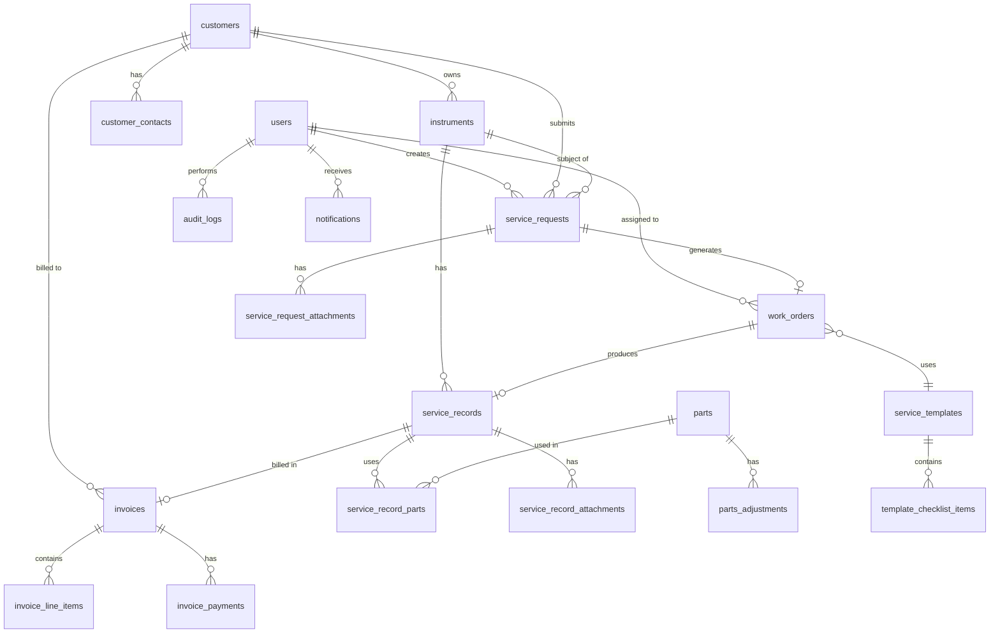

# Technical Design Document

## Overview

The Petro Scientific SPA is a full-stack web application for managing service operations for laboratory and material science instrument repair and maintenance. The system provides role-based access for administrators, managers, technicians, and customer users to handle the complete service lifecycle from request submission through invoicing.

### System Goals

- Streamline service request intake and management
- Optimize technician scheduling and resource allocation
- Maintain comprehensive instrument service history
- Automate invoicing and billing processes
- Provide real-time visibility into service operations
- Enable customer self-service through portal access

### Technology Stack

**Frontend:**
- Angular 19.2.0 with standalone components
- TypeScript 5.7.2 (strict mode)
- RxJS 7.8.0 for reactive programming
- SCSS for styling
- Angular Material or PrimeNG for UI components

**Backend:**
- Node.js 20.x LTS
- Express.js 4.x for REST API
- TypeScript for type safety
- JWT for authentication
- Multer for file uploads

**Database:**
- PostgreSQL 15.x (primary recommendation)
- Connection pooling with pg-pool
- Migrations with node-pg-migrate or TypeORM

**Infrastructure:**
- Docker for containerization
- Nginx as reverse proxy
- PM2 for Node.js process management
- Automated daily backups

## Architecture

### System Architecture

The application follows a three-tier architecture with clear separation between presentation, business logic, and data layers.

```
┌─────────────────────────────────────────────────────────────┐
│                     Client Layer (Browser)                   │
│  ┌────────────────────────────────────────────────────────┐ │
│  │           Angular SPA (Port 4200/80)                   │ │
│  │  - Standalone Components                               │ │
│  │  - RxJS State Management                               │ │
│  │  - Angular Router                                      │ │
│  │  - HTTP Interceptors (Auth, Error)                     │ │
│  └────────────────────────────────────────────────────────┘ │
└─────────────────────────────────────────────────────────────┘
                            │
                    HTTPS/REST API
                            │
┌─────────────────────────────────────────────────────────────┐
│                   Application Server Layer                   │
│  ┌────────────────────────────────────────────────────────┐ │
│  │         Node.js/Express API (Port 3000)                │ │
│  │  ┌──────────────────────────────────────────────────┐ │ │
│  │  │  Authentication Middleware (JWT)                  │ │ │
│  │  └──────────────────────────────────────────────────┘ │ │
│  │  ┌──────────────────────────────────────────────────┐ │ │
│  │  │  Route Controllers                                │ │ │
│  │  │  - Service Requests  - Customers                  │ │ │
│  │  │  - Work Orders       - Instruments                │ │ │
│  │  │  - Invoices          - Parts                      │ │ │
│  │  │  - Users             - Reports                    │ │ │
│  │  └──────────────────────────────────────────────────┘ │ │
│  │  ┌──────────────────────────────────────────────────┐ │ │
│  │  │  Business Logic Services                          │ │ │
│  │  │  - Validation        - Notifications              │ │ │
│  │  │  - Authorization     - File Upload                │ │ │
│  │  │  - Scheduling        - Reporting                  │ │ │
│  │  └──────────────────────────────────────────────────┘ │ │
│  │  ┌──────────────────────────────────────────────────┐ │ │
│  │  │  Data Access Layer (Repositories)                 │ │ │
│  │  └──────────────────────────────────────────────────┘ │ │
│  └────────────────────────────────────────────────────────┘ │
└─────────────────────────────────────────────────────────────┘
                            │
                      SQL Queries
                            │
┌─────────────────────────────────────────────────────────────┐
│                      Data Layer                              │
│  ┌────────────────────────────────────────────────────────┐ │
│  │         PostgreSQL Database (Port 5432)                │ │
│  │  - Relational Schema                                   │ │
│  │  - Indexes for Performance                             │ │
│  │  - Foreign Key Constraints                             │ │
│  │  - Audit Triggers                                      │ │
│  └────────────────────────────────────────────────────────┘ │
│  ┌────────────────────────────────────────────────────────┐ │
│  │         File Storage (Local/S3)                        │ │
│  │  - Service Request Attachments                         │ │
│  │  - Service Record Photos                               │ │
│  │  - Invoice PDFs                                        │ │
│  └────────────────────────────────────────────────────────┘ │
└─────────────────────────────────────────────────────────────┘
```

### Communication Patterns

**Frontend to Backend:**
- RESTful HTTP/HTTPS requests
- JSON payload format
- JWT token in Authorization header
- File uploads via multipart/form-data

**Backend to Database:**
- Parameterized SQL queries via pg library
- Connection pooling for performance
- Transaction support for multi-step operations

**Notification Flow:**
- In-app: WebSocket or Server-Sent Events for real-time updates
- Email: SMTP integration (SendGrid, AWS SES, or similar)

### Security Architecture

**Authentication Flow:**
1. User submits credentials to `/api/v1/auth/login`
2. Backend validates credentials against database
3. Backend generates JWT with user ID, role, and expiration
4. Frontend stores JWT in memory (not localStorage for security)
5. Frontend includes JWT in Authorization header for all requests
6. Backend middleware validates JWT on protected routes

**Authorization Strategy:**
- Role-Based Access Control (RBAC)
- Middleware checks user role against route permissions
- Frontend guards prevent unauthorized route access
- Backend enforces authorization on all endpoints

## Components and Interfaces

### Frontend Component Architecture

The Angular application uses standalone components organized by feature modules with a shared component library.


#### Application Structure

```
src/app/
├── core/                           # Core singleton services
│   ├── auth/
│   │   ├── auth.service.ts         # Authentication logic
│   │   ├── auth.guard.ts           # Route protection
│   │   ├── role.guard.ts           # Role-based route protection
│   │   └── auth.interceptor.ts     # JWT injection
│   ├── api/
│   │   ├── api.service.ts          # Base HTTP service
│   │   └── error.interceptor.ts    # Global error handling
│   ├── notification/
│   │   └── notification.service.ts # In-app notifications
│   └── state/
│       └── user-state.service.ts   # Current user state
│
├── shared/                         # Shared components library
│   ├── components/
│   │   ├── data-table/             # Reusable table with sorting/filtering
│   │   ├── form-field/             # Consistent form inputs
│   │   ├── modal/                  # Modal dialog wrapper
│   │   ├── file-upload/            # File upload component
│   │   ├── status-badge/           # Status indicator
│   │   ├── date-picker/            # Date selection
│   │   ├── search-bar/             # Search input with debounce
│   │   ├── pagination/             # Pagination controls
│   │   ├── loading-spinner/        # Loading indicator
│   │   └── confirmation-dialog/    # Confirmation prompts
│   ├── directives/
│   │   ├── has-role.directive.ts   # Conditional rendering by role
│   │   └── auto-focus.directive.ts # Auto-focus inputs
│   ├── pipes/
│   │   ├── date-format.pipe.ts     # Consistent date formatting
│   │   ├── currency.pipe.ts        # Currency formatting
│   │   └── status-label.pipe.ts    # Status enum to label
│   └── models/                     # TypeScript interfaces
│       ├── user.model.ts
│       ├── service-request.model.ts
│       ├── instrument.model.ts
│       ├── work-order.model.ts
│       ├── customer.model.ts
│       ├── invoice.model.ts
│       └── ...
│
├── features/                       # Feature modules
│   ├── auth/
│   │   ├── login/
│   │   │   ├── login.component.ts
│   │   │   ├── login.component.html
│   │   │   └── login.component.scss
│   │   └── auth.routes.ts
│   │
│   ├── dashboard/
│   │   ├── dashboard.component.ts  # Role-specific dashboard
│   │   ├── widgets/
│   │   │   ├── pending-requests-widget/
│   │   │   ├── active-workorders-widget/
│   │   │   ├── overdue-invoices-widget/
│   │   │   └── technician-schedule-widget/
│   │   └── dashboard.routes.ts
│   │
│   ├── service-requests/
│   │   ├── service-request-list/
│   │   ├── service-request-detail/
│   │   ├── service-request-form/
│   │   ├── service-request.service.ts
│   │   └── service-requests.routes.ts
│   │
│   ├── instruments/
│   │   ├── instrument-list/
│   │   ├── instrument-detail/
│   │   ├── instrument-form/
│   │   ├── instrument-history/
│   │   ├── instrument.service.ts
│   │   └── instruments.routes.ts
│   │
│   ├── work-orders/
│   │   ├── work-order-list/
│   │   ├── work-order-detail/
│   │   ├── work-order-execution/    # Technician work interface
│   │   ├── work-order.service.ts
│   │   └── work-orders.routes.ts
│   │
│   ├── scheduling/
│   │   ├── calendar-view/
│   │   ├── technician-availability/
│   │   ├── scheduling.service.ts
│   │   └── scheduling.routes.ts
│   │
│   ├── customers/
│   │   ├── customer-list/
│   │   ├── customer-detail/
│   │   ├── customer-form/
│   │   ├── customer.service.ts
│   │   └── customers.routes.ts
│   │
│   ├── parts/
│   │   ├── parts-list/
│   │   ├── parts-detail/
│   │   ├── parts-adjustment/
│   │   ├── parts.service.ts
│   │   └── parts.routes.ts
│   │
│   ├── invoices/
│   │   ├── invoice-list/
│   │   ├── invoice-detail/
│   │   ├── invoice-generator/
│   │   ├── invoice.service.ts
│   │   └── invoices.routes.ts
│   │
│   ├── reports/
│   │   ├── report-dashboard/
│   │   ├── service-volume-report/
│   │   ├── technician-productivity-report/
│   │   ├── revenue-report/
│   │   ├── report.service.ts
│   │   └── reports.routes.ts
│   │
│   ├── templates/
│   │   ├── template-list/
│   │   ├── template-editor/
│   │   ├── template.service.ts
│   │   └── templates.routes.ts
│   │
│   └── admin/
│       ├── user-management/
│       ├── audit-log/
│       ├── system-settings/
│       └── admin.routes.ts
│
├── app.component.ts                # Root component
├── app.config.ts                   # App configuration
└── app.routes.ts                   # Root routing
```

#### Key Shared Components

**DataTableComponent:**
- Generic table with column configuration
- Built-in sorting, filtering, pagination
- Row selection and bulk actions
- Export to CSV functionality
- Responsive design with mobile view

**FormFieldComponent:**
- Consistent styling across all forms
- Built-in validation display
- Support for text, number, date, select, textarea
- Accessibility compliant

**FileUploadComponent:**
- Drag-and-drop interface
- File type and size validation
- Preview for images
- Progress indicator
- Multiple file support

**StatusBadgeComponent:**
- Color-coded status indicators
- Configurable status mappings
- Consistent visual language

### Backend API Structure

```
src/
├── config/
│   ├── database.ts                 # Database connection config
│   ├── auth.ts                     # JWT secret and settings
│   └── environment.ts              # Environment variables
│
├── middleware/
│   ├── authenticate.ts             # JWT validation
│   ├── authorize.ts                # Role-based authorization
│   ├── validate.ts                 # Request validation
│   ├── error-handler.ts            # Global error handling
│   └── rate-limiter.ts             # Rate limiting
│
├── routes/
│   ├── auth.routes.ts              # /api/v1/auth/*
│   ├── service-requests.routes.ts  # /api/v1/service-requests/*
│   ├── instruments.routes.ts       # /api/v1/instruments/*
│   ├── work-orders.routes.ts       # /api/v1/work-orders/*
│   ├── customers.routes.ts         # /api/v1/customers/*
│   ├── technicians.routes.ts       # /api/v1/technicians/*
│   ├── parts.routes.ts             # /api/v1/parts/*
│   ├── invoices.routes.ts          # /api/v1/invoices/*
│   ├── reports.routes.ts           # /api/v1/reports/*
│   ├── templates.routes.ts         # /api/v1/templates/*
│   ├── notifications.routes.ts     # /api/v1/notifications/*
│   └── users.routes.ts             # /api/v1/users/*
│
├── controllers/
│   ├── auth.controller.ts
│   ├── service-request.controller.ts
│   ├── instrument.controller.ts
│   ├── work-order.controller.ts
│   ├── customer.controller.ts
│   ├── technician.controller.ts
│   ├── parts.controller.ts
│   ├── invoice.controller.ts
│   ├── report.controller.ts
│   ├── template.controller.ts
│   ├── notification.controller.ts
│   └── user.controller.ts
│
├── services/
│   ├── auth.service.ts             # Authentication logic
│   ├── validation.service.ts       # Business rule validation
│   ├── notification.service.ts     # Email and in-app notifications
│   ├── file-storage.service.ts     # File upload/download
│   ├── pdf-generator.service.ts    # Invoice PDF generation
│   ├── scheduling.service.ts       # Scheduling logic
│   ├── audit.service.ts            # Audit logging
│   └── backup.service.ts           # Backup operations
│
├── repositories/
│   ├── user.repository.ts
│   ├── service-request.repository.ts
│   ├── instrument.repository.ts
│   ├── work-order.repository.ts
│   ├── customer.repository.ts
│   ├── technician.repository.ts
│   ├── parts.repository.ts
│   ├── invoice.repository.ts
│   ├── template.repository.ts
│   ├── notification.repository.ts
│   └── audit.repository.ts
│
├── models/
│   ├── user.model.ts
│   ├── service-request.model.ts
│   ├── instrument.model.ts
│   ├── work-order.model.ts
│   ├── customer.model.ts
│   ├── technician.model.ts
│   ├── parts.model.ts
│   ├── invoice.model.ts
│   └── ...
│
├── utils/
│   ├── logger.ts                   # Logging utility
│   ├── validators.ts               # Common validators
│   └── date-helpers.ts             # Date utilities
│
└── app.ts                          # Express app setup
```

### API Endpoints

#### Authentication Endpoints

```
POST   /api/v1/auth/login           # User login
POST   /api/v1/auth/logout          # User logout
POST   /api/v1/auth/refresh         # Refresh JWT token
GET    /api/v1/auth/me              # Get current user info
```

#### Service Request Endpoints

```
GET    /api/v1/service-requests                    # List all (filtered by role)
GET    /api/v1/service-requests/:id                # Get single request
POST   /api/v1/service-requests                    # Create new request
PUT    /api/v1/service-requests/:id                # Update request
PATCH  /api/v1/service-requests/:id/status         # Update status
POST   /api/v1/service-requests/:id/attachments    # Upload attachment
GET    /api/v1/service-requests/:id/attachments    # List attachments
DELETE /api/v1/service-requests/:id/attachments/:attachmentId  # Delete attachment
```

#### Instrument Endpoints

```
GET    /api/v1/instruments                         # List all instruments
GET    /api/v1/instruments/:id                     # Get single instrument
POST   /api/v1/instruments                         # Register new instrument
PUT    /api/v1/instruments/:id                     # Update instrument
PATCH  /api/v1/instruments/:id/status              # Update status
GET    /api/v1/instruments/:id/history             # Get service history
GET    /api/v1/instruments/serial/:serialNumber    # Find by serial number
```

#### Work Order Endpoints

```
GET    /api/v1/work-orders                         # List work orders
GET    /api/v1/work-orders/:id                     # Get single work order
POST   /api/v1/work-orders                         # Create work order
PUT    /api/v1/work-orders/:id                     # Update work order
PATCH  /api/v1/work-orders/:id/status              # Update status
POST   /api/v1/work-orders/:id/complete            # Complete work order
GET    /api/v1/work-orders/technician/:techId      # Get by technician
```

#### Customer Endpoints

```
GET    /api/v1/customers                           # List all customers
GET    /api/v1/customers/:id                       # Get single customer
POST   /api/v1/customers                           # Create customer
PUT    /api/v1/customers/:id                       # Update customer
DELETE /api/v1/customers/:id                       # Delete customer (soft)
GET    /api/v1/customers/:id/instruments           # Get customer instruments
GET    /api/v1/customers/:id/service-requests      # Get customer requests
POST   /api/v1/customers/:id/contacts              # Add contact person
```

#### Technician Endpoints

```
GET    /api/v1/technicians                         # List all technicians
GET    /api/v1/technicians/:id                     # Get single technician
GET    /api/v1/technicians/:id/availability        # Get availability calendar
PUT    /api/v1/technicians/:id/availability        # Update availability
GET    /api/v1/technicians/:id/workload            # Get workload metrics
GET    /api/v1/technicians/:id/schedule            # Get schedule (date range)
```

#### Parts Endpoints

```
GET    /api/v1/parts                               # List all parts
GET    /api/v1/parts/:id                           # Get single part
POST   /api/v1/parts                               # Create part
PUT    /api/v1/parts/:id                           # Update part
POST   /api/v1/parts/:id/adjust                    # Adjust inventory
GET    /api/v1/parts/:id/history                   # Get usage history
GET    /api/v1/parts/reorder                       # Get parts needing reorder
```

#### Invoice Endpoints

```
GET    /api/v1/invoices                            # List all invoices
GET    /api/v1/invoices/:id                        # Get single invoice
POST   /api/v1/invoices                            # Generate invoice
PUT    /api/v1/invoices/:id                        # Update invoice (draft only)
PATCH  /api/v1/invoices/:id/status                 # Update status
POST   /api/v1/invoices/:id/send                   # Mark as sent
POST   /api/v1/invoices/:id/payment                # Record payment
GET    /api/v1/invoices/:id/pdf                    # Download PDF
GET    /api/v1/invoices/overdue                    # Get overdue invoices
```

#### Report Endpoints

```
GET    /api/v1/reports/service-volume              # Service volume report
GET    /api/v1/reports/technician-productivity     # Technician productivity
GET    /api/v1/reports/revenue                     # Revenue report
GET    /api/v1/reports/completion-time             # Avg completion time
GET    /api/v1/reports/dashboard-metrics           # Dashboard KPIs
POST   /api/v1/reports/export                      # Export report (PDF/CSV)
```

#### Template Endpoints

```
GET    /api/v1/templates                           # List all templates
GET    /api/v1/templates/:id                       # Get single template
POST   /api/v1/templates                           # Create template
PUT    /api/v1/templates/:id                       # Update template
DELETE /api/v1/templates/:id                       # Delete template
GET    /api/v1/templates/instrument-type/:type     # Get by instrument type
GET    /api/v1/templates/:id/usage-stats           # Get usage statistics
```

#### Notification Endpoints

```
GET    /api/v1/notifications                       # Get user notifications
PATCH  /api/v1/notifications/:id/read              # Mark as read
PATCH  /api/v1/notifications/read-all              # Mark all as read
GET    /api/v1/notifications/preferences           # Get preferences
PUT    /api/v1/notifications/preferences           # Update preferences
```

#### User Management Endpoints

```
GET    /api/v1/users                               # List all users (admin)
GET    /api/v1/users/:id                           # Get single user
POST   /api/v1/users                               # Create user (admin)
PUT    /api/v1/users/:id                           # Update user
DELETE /api/v1/users/:id                           # Delete user (admin)
PATCH  /api/v1/users/:id/password                  # Change password
```

#### Audit Endpoints

```
GET    /api/v1/audit                               # Get audit logs (admin)
GET    /api/v1/audit/user/:userId                  # Get logs by user
GET    /api/v1/audit/entity/:entityType/:entityId  # Get logs by entity
```

### Request/Response Formats

**Standard Success Response:**
```json
{
  "success": true,
  "data": { /* response data */ },
  "message": "Operation completed successfully"
}
```

**Standard Error Response:**
```json
{
  "success": false,
  "error": {
    "code": "VALIDATION_ERROR",
    "message": "Validation failed",
    "details": [
      {
        "field": "email",
        "message": "Invalid email format"
      }
    ]
  }
}
```

**Paginated List Response:**
```json
{
  "success": true,
  "data": {
    "items": [ /* array of items */ ],
    "pagination": {
      "page": 1,
      "pageSize": 20,
      "totalItems": 150,
      "totalPages": 8
    }
  }
}
```

## Data Models

### Database Schema (PostgreSQL)


#### Entity Relationship Diagram



#### Core Tables

**users**
```sql
CREATE TABLE users (
    id SERIAL PRIMARY KEY,
    email VARCHAR(255) UNIQUE NOT NULL,
    password_hash VARCHAR(255) NOT NULL,
    first_name VARCHAR(100) NOT NULL,
    last_name VARCHAR(100) NOT NULL,
    role VARCHAR(50) NOT NULL CHECK (role IN ('Administrator', 'Manager', 'Technician', 'Customer_User')),
    customer_id INTEGER REFERENCES customers(id),  -- For Customer_User role
    is_active BOOLEAN DEFAULT true,
    last_login_at TIMESTAMP,
    created_at TIMESTAMP DEFAULT CURRENT_TIMESTAMP,
    updated_at TIMESTAMP DEFAULT CURRENT_TIMESTAMP,
    created_by INTEGER REFERENCES users(id),
    updated_by INTEGER REFERENCES users(id)
);

CREATE INDEX idx_users_email ON users(email);
CREATE INDEX idx_users_role ON users(role);
CREATE INDEX idx_users_customer_id ON users(customer_id);
```

**customers**
```sql
CREATE TABLE customers (
    id SERIAL PRIMARY KEY,
    organization_name VARCHAR(255) NOT NULL,
    primary_contact_name VARCHAR(255) NOT NULL,
    primary_contact_phone VARCHAR(50) NOT NULL,
    primary_contact_email VARCHAR(255) NOT NULL,
    billing_address_line1 VARCHAR(255) NOT NULL,
    billing_address_line2 VARCHAR(255),
    billing_city VARCHAR(100) NOT NULL,
    billing_state VARCHAR(50) NOT NULL,
    billing_postal_code VARCHAR(20) NOT NULL,
    billing_country VARCHAR(100) NOT NULL DEFAULT 'USA',
    service_address_line1 VARCHAR(255),
    service_address_line2 VARCHAR(255),
    service_city VARCHAR(100),
    service_state VARCHAR(50),
    service_postal_code VARCHAR(20),
    service_country VARCHAR(100),
    notes TEXT,
    is_active BOOLEAN DEFAULT true,
    created_at TIMESTAMP DEFAULT CURRENT_TIMESTAMP,
    updated_at TIMESTAMP DEFAULT CURRENT_TIMESTAMP,
    created_by INTEGER REFERENCES users(id),
    updated_by INTEGER REFERENCES users(id)
);

CREATE INDEX idx_customers_organization_name ON customers(organization_name);
CREATE INDEX idx_customers_email ON customers(primary_contact_email);
```

**customer_contacts**
```sql
CREATE TABLE customer_contacts (
    id SERIAL PRIMARY KEY,
    customer_id INTEGER NOT NULL REFERENCES customers(id) ON DELETE CASCADE,
    name VARCHAR(255) NOT NULL,
    title VARCHAR(100),
    phone VARCHAR(50),
    email VARCHAR(255),
    is_primary BOOLEAN DEFAULT false,
    created_at TIMESTAMP DEFAULT CURRENT_TIMESTAMP,
    updated_at TIMESTAMP DEFAULT CURRENT_TIMESTAMP
);

CREATE INDEX idx_customer_contacts_customer_id ON customer_contacts(customer_id);
```

**instruments**
```sql
CREATE TABLE instruments (
    id SERIAL PRIMARY KEY,
    customer_id INTEGER NOT NULL REFERENCES customers(id),
    manufacturer VARCHAR(255) NOT NULL,
    model VARCHAR(255) NOT NULL,
    serial_number VARCHAR(255) UNIQUE NOT NULL,
    instrument_type VARCHAR(100),
    location VARCHAR(255),
    status VARCHAR(50) NOT NULL DEFAULT 'In_Service' 
        CHECK (status IN ('In_Service', 'Under_Repair', 'Awaiting_Parts', 'Ready_For_Pickup')),
    notes TEXT,
    created_at TIMESTAMP DEFAULT CURRENT_TIMESTAMP,
    updated_at TIMESTAMP DEFAULT CURRENT_TIMESTAMP,
    created_by INTEGER REFERENCES users(id),
    updated_by INTEGER REFERENCES users(id)
);

CREATE INDEX idx_instruments_customer_id ON instruments(customer_id);
CREATE INDEX idx_instruments_serial_number ON instruments(serial_number);
CREATE INDEX idx_instruments_status ON instruments(status);
CREATE INDEX idx_instruments_model ON instruments(model);
```

**service_requests**
```sql
CREATE TABLE service_requests (
    id SERIAL PRIMARY KEY,
    request_number VARCHAR(50) UNIQUE NOT NULL,  -- e.g., SR-2024-00001
    customer_id INTEGER NOT NULL REFERENCES customers(id),
    instrument_id INTEGER NOT NULL REFERENCES instruments(id),
    problem_description TEXT NOT NULL,
    priority VARCHAR(50) NOT NULL DEFAULT 'Normal' 
        CHECK (priority IN ('Low', 'Normal', 'High', 'Urgent')),
    preferred_service_date DATE,
    status VARCHAR(50) NOT NULL DEFAULT 'Pending' 
        CHECK (status IN ('Pending', 'Scheduled', 'In_Progress', 'Completed', 'Cancelled')),
    notes TEXT,
    submitted_at TIMESTAMP DEFAULT CURRENT_TIMESTAMP,
    created_at TIMESTAMP DEFAULT CURRENT_TIMESTAMP,
    updated_at TIMESTAMP DEFAULT CURRENT_TIMESTAMP,
    created_by INTEGER REFERENCES users(id),
    updated_by INTEGER REFERENCES users(id)
);

CREATE INDEX idx_service_requests_customer_id ON service_requests(customer_id);
CREATE INDEX idx_service_requests_instrument_id ON service_requests(instrument_id);
CREATE INDEX idx_service_requests_status ON service_requests(status);
CREATE INDEX idx_service_requests_priority ON service_requests(priority);
CREATE INDEX idx_service_requests_submitted_at ON service_requests(submitted_at);
```

**service_request_attachments**
```sql
CREATE TABLE service_request_attachments (
    id SERIAL PRIMARY KEY,
    service_request_id INTEGER NOT NULL REFERENCES service_requests(id) ON DELETE CASCADE,
    file_name VARCHAR(255) NOT NULL,
    file_path VARCHAR(500) NOT NULL,
    file_size INTEGER NOT NULL,
    mime_type VARCHAR(100) NOT NULL,
    uploaded_at TIMESTAMP DEFAULT CURRENT_TIMESTAMP,
    uploaded_by INTEGER REFERENCES users(id)
);

CREATE INDEX idx_sr_attachments_service_request_id ON service_request_attachments(service_request_id);
```

**service_templates**
```sql
CREATE TABLE service_templates (
    id SERIAL PRIMARY KEY,
    name VARCHAR(255) NOT NULL,
    description TEXT,
    instrument_type VARCHAR(100),
    version INTEGER DEFAULT 1,
    is_active BOOLEAN DEFAULT true,
    created_at TIMESTAMP DEFAULT CURRENT_TIMESTAMP,
    updated_at TIMESTAMP DEFAULT CURRENT_TIMESTAMP,
    created_by INTEGER REFERENCES users(id),
    updated_by INTEGER REFERENCES users(id)
);

CREATE INDEX idx_service_templates_instrument_type ON service_templates(instrument_type);
CREATE INDEX idx_service_templates_is_active ON service_templates(is_active);
```

**template_checklist_items**
```sql
CREATE TABLE template_checklist_items (
    id SERIAL PRIMARY KEY,
    template_id INTEGER NOT NULL REFERENCES service_templates(id) ON DELETE CASCADE,
    item_order INTEGER NOT NULL,
    item_text TEXT NOT NULL,
    is_required BOOLEAN DEFAULT false,
    created_at TIMESTAMP DEFAULT CURRENT_TIMESTAMP
);

CREATE INDEX idx_template_items_template_id ON template_checklist_items(template_id);
```

**work_orders**
```sql
CREATE TABLE work_orders (
    id SERIAL PRIMARY KEY,
    work_order_number VARCHAR(50) UNIQUE NOT NULL,  -- e.g., WO-2024-00001
    service_request_id INTEGER NOT NULL REFERENCES service_requests(id),
    assigned_technician_id INTEGER NOT NULL REFERENCES users(id),
    template_id INTEGER REFERENCES service_templates(id),
    scheduled_date DATE NOT NULL,
    scheduled_start_time TIME,
    scheduled_end_time TIME,
    actual_start_time TIMESTAMP,
    actual_end_time TIMESTAMP,
    status VARCHAR(50) NOT NULL DEFAULT 'Scheduled' 
        CHECK (status IN ('Scheduled', 'In_Progress', 'Completed', 'Cancelled')),
    notes TEXT,
    created_at TIMESTAMP DEFAULT CURRENT_TIMESTAMP,
    updated_at TIMESTAMP DEFAULT CURRENT_TIMESTAMP,
    created_by INTEGER REFERENCES users(id),
    updated_by INTEGER REFERENCES users(id)
);

CREATE INDEX idx_work_orders_service_request_id ON work_orders(service_request_id);
CREATE INDEX idx_work_orders_assigned_technician_id ON work_orders(assigned_technician_id);
CREATE INDEX idx_work_orders_scheduled_date ON work_orders(scheduled_date);
CREATE INDEX idx_work_orders_status ON work_orders(status);
```

**technician_availability**
```sql
CREATE TABLE technician_availability (
    id SERIAL PRIMARY KEY,
    technician_id INTEGER NOT NULL REFERENCES users(id),
    date DATE NOT NULL,
    is_available BOOLEAN DEFAULT true,
    start_time TIME,
    end_time TIME,
    notes TEXT,
    created_at TIMESTAMP DEFAULT CURRENT_TIMESTAMP,
    updated_at TIMESTAMP DEFAULT CURRENT_TIMESTAMP,
    UNIQUE(technician_id, date)
);

CREATE INDEX idx_tech_availability_technician_id ON technician_availability(technician_id);
CREATE INDEX idx_tech_availability_date ON technician_availability(date);
```

**service_records**
```sql
CREATE TABLE service_records (
    id SERIAL PRIMARY KEY,
    work_order_id INTEGER NOT NULL REFERENCES work_orders(id),
    instrument_id INTEGER NOT NULL REFERENCES instruments(id),
    technician_id INTEGER NOT NULL REFERENCES users(id),
    work_performed TEXT NOT NULL,
    findings TEXT,
    labor_hours DECIMAL(5,2) NOT NULL,
    labor_rate DECIMAL(10,2) NOT NULL,
    labor_total DECIMAL(10,2) GENERATED ALWAYS AS (labor_hours * labor_rate) STORED,
    completed_at TIMESTAMP DEFAULT CURRENT_TIMESTAMP,
    created_at TIMESTAMP DEFAULT CURRENT_TIMESTAMP,
    updated_at TIMESTAMP DEFAULT CURRENT_TIMESTAMP
);

CREATE INDEX idx_service_records_work_order_id ON service_records(work_order_id);
CREATE INDEX idx_service_records_instrument_id ON service_records(instrument_id);
CREATE INDEX idx_service_records_technician_id ON service_records(technician_id);
CREATE INDEX idx_service_records_completed_at ON service_records(completed_at);
```

**service_record_attachments**
```sql
CREATE TABLE service_record_attachments (
    id SERIAL PRIMARY KEY,
    service_record_id INTEGER NOT NULL REFERENCES service_records(id) ON DELETE CASCADE,
    file_name VARCHAR(255) NOT NULL,
    file_path VARCHAR(500) NOT NULL,
    file_size INTEGER NOT NULL,
    mime_type VARCHAR(100) NOT NULL,
    uploaded_at TIMESTAMP DEFAULT CURRENT_TIMESTAMP,
    uploaded_by INTEGER REFERENCES users(id)
);

CREATE INDEX idx_sr_record_attachments_service_record_id ON service_record_attachments(service_record_id);
```

**parts**
```sql
CREATE TABLE parts (
    id SERIAL PRIMARY KEY,
    part_number VARCHAR(100) UNIQUE NOT NULL,
    description VARCHAR(255) NOT NULL,
    manufacturer VARCHAR(255),
    unit_cost DECIMAL(10,2) NOT NULL,
    quantity_on_hand INTEGER NOT NULL DEFAULT 0,
    reorder_threshold INTEGER NOT NULL DEFAULT 0,
    is_active BOOLEAN DEFAULT true,
    created_at TIMESTAMP DEFAULT CURRENT_TIMESTAMP,
    updated_at TIMESTAMP DEFAULT CURRENT_TIMESTAMP,
    created_by INTEGER REFERENCES users(id),
    updated_by INTEGER REFERENCES users(id),
    CONSTRAINT chk_quantity_non_negative CHECK (quantity_on_hand >= 0)
);

CREATE INDEX idx_parts_part_number ON parts(part_number);
CREATE INDEX idx_parts_quantity_on_hand ON parts(quantity_on_hand);
```

**service_record_parts**
```sql
CREATE TABLE service_record_parts (
    id SERIAL PRIMARY KEY,
    service_record_id INTEGER NOT NULL REFERENCES service_records(id) ON DELETE CASCADE,
    part_id INTEGER NOT NULL REFERENCES parts(id),
    quantity_used INTEGER NOT NULL,
    unit_cost DECIMAL(10,2) NOT NULL,
    total_cost DECIMAL(10,2) GENERATED ALWAYS AS (quantity_used * unit_cost) STORED,
    created_at TIMESTAMP DEFAULT CURRENT_TIMESTAMP
);

CREATE INDEX idx_sr_parts_service_record_id ON service_record_parts(service_record_id);
CREATE INDEX idx_sr_parts_part_id ON service_record_parts(part_id);
```

**parts_adjustments**
```sql
CREATE TABLE parts_adjustments (
    id SERIAL PRIMARY KEY,
    part_id INTEGER NOT NULL REFERENCES parts(id),
    adjustment_type VARCHAR(50) NOT NULL CHECK (adjustment_type IN ('Received', 'Damaged', 'Lost', 'Correction')),
    quantity_change INTEGER NOT NULL,
    reason TEXT NOT NULL,
    adjusted_at TIMESTAMP DEFAULT CURRENT_TIMESTAMP,
    adjusted_by INTEGER REFERENCES users(id)
);

CREATE INDEX idx_parts_adjustments_part_id ON parts_adjustments(part_id);
CREATE INDEX idx_parts_adjustments_adjusted_at ON parts_adjustments(adjusted_at);
```

**invoices**
```sql
CREATE TABLE invoices (
    id SERIAL PRIMARY KEY,
    invoice_number VARCHAR(50) UNIQUE NOT NULL,  -- e.g., INV-2024-00001
    customer_id INTEGER NOT NULL REFERENCES customers(id),
    service_record_id INTEGER REFERENCES service_records(id),
    invoice_date DATE NOT NULL DEFAULT CURRENT_DATE,
    due_date DATE NOT NULL,
    subtotal DECIMAL(10,2) NOT NULL,
    tax_rate DECIMAL(5,4) NOT NULL DEFAULT 0,
    tax_amount DECIMAL(10,2) NOT NULL,
    total_amount DECIMAL(10,2) NOT NULL,
    status VARCHAR(50) NOT NULL DEFAULT 'Draft' 
        CHECK (status IN ('Draft', 'Sent', 'Paid', 'Overdue', 'Cancelled')),
    payment_terms VARCHAR(100),
    notes TEXT,
    created_at TIMESTAMP DEFAULT CURRENT_TIMESTAMP,
    updated_at TIMESTAMP DEFAULT CURRENT_TIMESTAMP,
    created_by INTEGER REFERENCES users(id),
    updated_by INTEGER REFERENCES users(id)
);

CREATE INDEX idx_invoices_customer_id ON invoices(customer_id);
CREATE INDEX idx_invoices_service_record_id ON invoices(service_record_id);
CREATE INDEX idx_invoices_status ON invoices(status);
CREATE INDEX idx_invoices_due_date ON invoices(due_date);
CREATE INDEX idx_invoices_invoice_date ON invoices(invoice_date);
```

**invoice_line_items**
```sql
CREATE TABLE invoice_line_items (
    id SERIAL PRIMARY KEY,
    invoice_id INTEGER NOT NULL REFERENCES invoices(id) ON DELETE CASCADE,
    line_number INTEGER NOT NULL,
    description TEXT NOT NULL,
    quantity DECIMAL(10,2) NOT NULL,
    unit_price DECIMAL(10,2) NOT NULL,
    line_total DECIMAL(10,2) GENERATED ALWAYS AS (quantity * unit_price) STORED,
    created_at TIMESTAMP DEFAULT CURRENT_TIMESTAMP
);

CREATE INDEX idx_invoice_line_items_invoice_id ON invoice_line_items(invoice_id);
```

**invoice_payments**
```sql
CREATE TABLE invoice_payments (
    id SERIAL PRIMARY KEY,
    invoice_id INTEGER NOT NULL REFERENCES invoices(id),
    payment_date DATE NOT NULL,
    amount DECIMAL(10,2) NOT NULL,
    payment_method VARCHAR(50),
    reference_number VARCHAR(100),
    notes TEXT,
    recorded_at TIMESTAMP DEFAULT CURRENT_TIMESTAMP,
    recorded_by INTEGER REFERENCES users(id)
);

CREATE INDEX idx_invoice_payments_invoice_id ON invoice_payments(invoice_id);
CREATE INDEX idx_invoice_payments_payment_date ON invoice_payments(payment_date);
```

**notifications**
```sql
CREATE TABLE notifications (
    id SERIAL PRIMARY KEY,
    user_id INTEGER NOT NULL REFERENCES users(id),
    notification_type VARCHAR(50) NOT NULL 
        CHECK (notification_type IN ('ServiceRequestCreated', 'WorkOrderAssigned', 'ServiceCompleted', 
                                      'InvoiceOverdue', 'PriorityChanged', 'StatusChanged')),
    title VARCHAR(255) NOT NULL,
    message TEXT NOT NULL,
    related_entity_type VARCHAR(50),  -- e.g., 'ServiceRequest', 'WorkOrder', 'Invoice'
    related_entity_id INTEGER,
    is_read BOOLEAN DEFAULT false,
    email_sent BOOLEAN DEFAULT false,
    created_at TIMESTAMP DEFAULT CURRENT_TIMESTAMP
);

CREATE INDEX idx_notifications_user_id ON notifications(user_id);
CREATE INDEX idx_notifications_is_read ON notifications(is_read);
CREATE INDEX idx_notifications_created_at ON notifications(created_at);
```

**notification_preferences**
```sql
CREATE TABLE notification_preferences (
    id SERIAL PRIMARY KEY,
    user_id INTEGER NOT NULL REFERENCES users(id) UNIQUE,
    email_enabled BOOLEAN DEFAULT true,
    in_app_enabled BOOLEAN DEFAULT true,
    service_request_created BOOLEAN DEFAULT true,
    work_order_assigned BOOLEAN DEFAULT true,
    service_completed BOOLEAN DEFAULT true,
    invoice_overdue BOOLEAN DEFAULT true,
    priority_changed BOOLEAN DEFAULT true,
    created_at TIMESTAMP DEFAULT CURRENT_TIMESTAMP,
    updated_at TIMESTAMP DEFAULT CURRENT_TIMESTAMP
);

CREATE INDEX idx_notification_prefs_user_id ON notification_preferences(user_id);
```

**audit_logs**
```sql
CREATE TABLE audit_logs (
    id SERIAL PRIMARY KEY,
    user_id INTEGER REFERENCES users(id),
    action VARCHAR(50) NOT NULL CHECK (action IN ('CREATE', 'UPDATE', 'DELETE')),
    entity_type VARCHAR(100) NOT NULL,
    entity_id INTEGER NOT NULL,
    field_changes JSONB,  -- Store before/after values
    ip_address VARCHAR(45),
    user_agent TEXT,
    created_at TIMESTAMP DEFAULT CURRENT_TIMESTAMP
);

CREATE INDEX idx_audit_logs_user_id ON audit_logs(user_id);
CREATE INDEX idx_audit_logs_entity ON audit_logs(entity_type, entity_id);
CREATE INDEX idx_audit_logs_created_at ON audit_logs(created_at);
CREATE INDEX idx_audit_logs_action ON audit_logs(action);
```

#### Database Triggers

**Audit Logging Trigger:**
```sql
-- Generic audit trigger function
CREATE OR REPLACE FUNCTION audit_trigger_function()
RETURNS TRIGGER AS $$
BEGIN
    IF (TG_OP = 'DELETE') THEN
        INSERT INTO audit_logs (user_id, action, entity_type, entity_id, field_changes)
        VALUES (
            NULLIF(current_setting('app.current_user_id', TRUE), '')::INTEGER,
            'DELETE',
            TG_TABLE_NAME,
            OLD.id,
            row_to_json(OLD)::jsonb
        );
        RETURN OLD;
    ELSIF (TG_OP = 'UPDATE') THEN
        INSERT INTO audit_logs (user_id, action, entity_type, entity_id, field_changes)
        VALUES (
            NULLIF(current_setting('app.current_user_id', TRUE), '')::INTEGER,
            'UPDATE',
            TG_TABLE_NAME,
            NEW.id,
            jsonb_build_object('before', row_to_json(OLD)::jsonb, 'after', row_to_json(NEW)::jsonb)
        );
        RETURN NEW;
    ELSIF (TG_OP = 'INSERT') THEN
        INSERT INTO audit_logs (user_id, action, entity_type, entity_id, field_changes)
        VALUES (
            NULLIF(current_setting('app.current_user_id', TRUE), '')::INTEGER,
            'CREATE',
            TG_TABLE_NAME,
            NEW.id,
            row_to_json(NEW)::jsonb
        );
        RETURN NEW;
    END IF;
END;
$$ LANGUAGE plpgsql;

-- Apply to key tables
CREATE TRIGGER audit_service_requests
AFTER INSERT OR UPDATE OR DELETE ON service_requests
FOR EACH ROW EXECUTE FUNCTION audit_trigger_function();

CREATE TRIGGER audit_work_orders
AFTER INSERT OR UPDATE OR DELETE ON work_orders
FOR EACH ROW EXECUTE FUNCTION audit_trigger_function();

CREATE TRIGGER audit_invoices
AFTER INSERT OR UPDATE OR DELETE ON invoices
FOR EACH ROW EXECUTE FUNCTION audit_trigger_function();

-- Apply to other critical tables as needed
```

**Updated Timestamp Trigger:**
```sql
CREATE OR REPLACE FUNCTION update_updated_at_column()
RETURNS TRIGGER AS $$
BEGIN
    NEW.updated_at = CURRENT_TIMESTAMP;
    RETURN NEW;
END;
$$ LANGUAGE plpgsql;

-- Apply to all tables with updated_at column
CREATE TRIGGER update_users_updated_at BEFORE UPDATE ON users
FOR EACH ROW EXECUTE FUNCTION update_updated_at_column();

CREATE TRIGGER update_customers_updated_at BEFORE UPDATE ON customers
FOR EACH ROW EXECUTE FUNCTION update_updated_at_column();

-- Apply to other tables as needed
```

**Parts Inventory Trigger:**
```sql
CREATE OR REPLACE FUNCTION update_parts_inventory()
RETURNS TRIGGER AS $$
BEGIN
    -- Decrement inventory when parts are used
    UPDATE parts
    SET quantity_on_hand = quantity_on_hand - NEW.quantity_used
    WHERE id = NEW.part_id;
    
    -- Check if quantity went negative (should be prevented by constraint)
    IF (SELECT quantity_on_hand FROM parts WHERE id = NEW.part_id) < 0 THEN
        RAISE EXCEPTION 'Insufficient parts inventory for part_id %', NEW.part_id;
    END IF;
    
    RETURN NEW;
END;
$$ LANGUAGE plpgsql;

CREATE TRIGGER decrement_parts_inventory
AFTER INSERT ON service_record_parts
FOR EACH ROW EXECUTE FUNCTION update_parts_inventory();
```

### TypeScript Interfaces (Shared Models)

**User Model:**
```typescript
export enum UserRole {
  Administrator = 'Administrator',
  Manager = 'Manager',
  Technician = 'Technician',
  Customer_User = 'Customer_User'
}

export interface User {
  id: number;
  email: string;
  firstName: string;
  lastName: string;
  role: UserRole;
  customerId?: number;
  isActive: boolean;
  lastLoginAt?: Date;
  createdAt: Date;
  updatedAt: Date;
}

export interface AuthResponse {
  token: string;
  user: User;
  expiresIn: number;
}
```

**Service Request Model:**
```typescript
export enum ServiceStatus {
  Pending = 'Pending',
  Scheduled = 'Scheduled',
  In_Progress = 'In_Progress',
  Completed = 'Completed',
  Cancelled = 'Cancelled'
}

export enum Priority {
  Low = 'Low',
  Normal = 'Normal',
  High = 'High',
  Urgent = 'Urgent'
}

export interface ServiceRequest {
  id: number;
  requestNumber: string;
  customerId: number;
  instrumentId: number;
  problemDescription: string;
  priority: Priority;
  preferredServiceDate?: Date;
  status: ServiceStatus;
  notes?: string;
  submittedAt: Date;
  createdAt: Date;
  updatedAt: Date;
  
  // Populated relations
  customer?: Customer;
  instrument?: Instrument;
  attachments?: ServiceRequestAttachment[];
  workOrder?: WorkOrder;
}

export interface ServiceRequestAttachment {
  id: number;
  serviceRequestId: number;
  fileName: string;
  filePath: string;
  fileSize: number;
  mimeType: string;
  uploadedAt: Date;
  uploadedBy: number;
}
```

**Instrument Model:**
```typescript
export enum InstrumentStatus {
  In_Service = 'In_Service',
  Under_Repair = 'Under_Repair',
  Awaiting_Parts = 'Awaiting_Parts',
  Ready_For_Pickup = 'Ready_For_Pickup'
}

export interface Instrument {
  id: number;
  customerId: number;
  manufacturer: string;
  model: string;
  serialNumber: string;
  instrumentType?: string;
  location?: string;
  status: InstrumentStatus;
  notes?: string;
  createdAt: Date;
  updatedAt: Date;
  
  // Populated relations
  customer?: Customer;
  serviceHistory?: ServiceRecord[];
}
```

**Work Order Model:**
```typescript
export interface WorkOrder {
  id: number;
  workOrderNumber: string;
  serviceRequestId: number;
  assignedTechnicianId: number;
  templateId?: number;
  scheduledDate: Date;
  scheduledStartTime?: string;
  scheduledEndTime?: string;
  actualStartTime?: Date;
  actualEndTime?: Date;
  status: string;
  notes?: string;
  createdAt: Date;
  updatedAt: Date;
  
  // Populated relations
  serviceRequest?: ServiceRequest;
  technician?: User;
  template?: ServiceTemplate;
  serviceRecord?: ServiceRecord;
}
```

**Customer Model:**
```typescript
export interface Customer {
  id: number;
  organizationName: string;
  primaryContactName: string;
  primaryContactPhone: string;
  primaryContactEmail: string;
  billingAddressLine1: string;
  billingAddressLine2?: string;
  billingCity: string;
  billingState: string;
  billingPostalCode: string;
  billingCountry: string;
  serviceAddressLine1?: string;
  serviceAddressLine2?: string;
  serviceCity?: string;
  serviceState?: string;
  servicePostalCode?: string;
  serviceCountry?: string;
  notes?: string;
  isActive: boolean;
  createdAt: Date;
  updatedAt: Date;
  
  // Populated relations
  contacts?: CustomerContact[];
  instruments?: Instrument[];
}

export interface CustomerContact {
  id: number;
  customerId: number;
  name: string;
  title?: string;
  phone?: string;
  email?: string;
  isPrimary: boolean;
  createdAt: Date;
  updatedAt: Date;
}
```

**Invoice Model:**
```typescript
export enum InvoiceStatus {
  Draft = 'Draft',
  Sent = 'Sent',
  Paid = 'Paid',
  Overdue = 'Overdue',
  Cancelled = 'Cancelled'
}

export interface Invoice {
  id: number;
  invoiceNumber: string;
  customerId: number;
  serviceRecordId?: number;
  invoiceDate: Date;
  dueDate: Date;
  subtotal: number;
  taxRate: number;
  taxAmount: number;
  totalAmount: number;
  status: InvoiceStatus;
  paymentTerms?: string;
  notes?: string;
  createdAt: Date;
  updatedAt: Date;
  
  // Populated relations
  customer?: Customer;
  serviceRecord?: ServiceRecord;
  lineItems?: InvoiceLineItem[];
  payments?: InvoicePayment[];
}

export interface InvoiceLineItem {
  id: number;
  invoiceId: number;
  lineNumber: number;
  description: string;
  quantity: number;
  unitPrice: number;
  lineTotal: number;
  createdAt: Date;
}

export interface InvoicePayment {
  id: number;
  invoiceId: number;
  paymentDate: Date;
  amount: number;
  paymentMethod?: string;
  referenceNumber?: string;
  notes?: string;
  recordedAt: Date;
  recordedBy: number;
}
```

**Parts Model:**
```typescript
export interface Part {
  id: number;
  partNumber: string;
  description: string;
  manufacturer?: string;
  unitCost: number;
  quantityOnHand: number;
  reorderThreshold: number;
  isActive: boolean;
  createdAt: Date;
  updatedAt: Date;
  
  // Computed
  needsReorder?: boolean;
}

export interface PartsAdjustment {
  id: number;
  partId: number;
  adjustmentType: 'Received' | 'Damaged' | 'Lost' | 'Correction';
  quantityChange: number;
  reason: string;
  adjustedAt: Date;
  adjustedBy: number;
}
```

**Service Template Model:**
```typescript
export interface ServiceTemplate {
  id: number;
  name: string;
  description?: string;
  instrumentType?: string;
  version: number;
  isActive: boolean;
  createdAt: Date;
  updatedAt: Date;
  
  // Populated relations
  checklistItems?: TemplateChecklistItem[];
  usageStats?: TemplateUsageStats;
}

export interface TemplateChecklistItem {
  id: number;
  templateId: number;
  itemOrder: number;
  itemText: string;
  isRequired: boolean;
  createdAt: Date;
}

export interface TemplateUsageStats {
  templateId: number;
  usageCount: number;
  lastUsedAt?: Date;
}
```

**Notification Model:**
```typescript
export enum NotificationType {
  ServiceRequestCreated = 'ServiceRequestCreated',
  WorkOrderAssigned = 'WorkOrderAssigned',
  ServiceCompleted = 'ServiceCompleted',
  InvoiceOverdue = 'InvoiceOverdue',
  PriorityChanged = 'PriorityChanged',
  StatusChanged = 'StatusChanged'
}

export interface Notification {
  id: number;
  userId: number;
  notificationType: NotificationType;
  title: string;
  message: string;
  relatedEntityType?: string;
  relatedEntityId?: number;
  isRead: boolean;
  emailSent: boolean;
  createdAt: Date;
}

export interface NotificationPreferences {
  id: number;
  userId: number;
  emailEnabled: boolean;
  inAppEnabled: boolean;
  serviceRequestCreated: boolean;
  workOrderAssigned: boolean;
  serviceCompleted: boolean;
  invoiceOverdue: boolean;
  priorityChanged: boolean;
  createdAt: Date;
  updatedAt: Date;
}
```


## Correctness Properties

*A property is a characteristic or behavior that should hold true across all valid executions of a system—essentially, a formal statement about what the system should do. Properties serve as the bridge between human-readable specifications and machine-verifiable correctness guarantees.*

### Property Reflection

After analyzing all acceptance criteria, I identified several areas where properties can be consolidated to avoid redundancy:

**Consolidated Areas:**
1. **Authentication properties** (1.1, 1.2) can be combined into a single authentication round-trip property
2. **Role-based authorization** (1.4-1.7) can be consolidated into a single property about role permissions
3. **Unique identifier generation** (2.2, 4.2, 7.2, 9.3) follows the same pattern across entities
4. **Audit logging** (3.2, 4.7, 8.7, 13.1-13.3) can be consolidated into properties about audit trail completeness
5. **Notification delivery** (2.4, 3.6, 5.5, 11.1-11.3, 11.6) can be consolidated into properties about notification triggers
6. **Data isolation for customers** (1.7, 18.1, 18.6) can be combined into a single property
7. **File attachment** (2.5, 6.5) follows the same pattern for different entities
8. **Referential integrity** (3.5, 7.7) follows the same pattern for preventing deletion
9. **Search functionality** (12.1-12.3) follows the same pattern across entities
10. **CSV export** (16.1-16.3) follows the same pattern across entities
11. **CSV import** (16.4-16.5) follows the same pattern across entities

### Authentication and Authorization Properties

### Property 1: Valid Credentials Authentication

*For any* user with valid credentials in the system, when they attempt to log in, the system should authenticate them successfully and return a valid JWT token.

**Validates: Requirements 1.1**

### Property 2: Invalid Credentials Rejection

*For any* login attempt with credentials that don't match any user in the system, the system should reject the authentication and return an error message.

**Validates: Requirements 1.2**

### Property 3: Role-Based Access Control

*For any* authenticated user and any API endpoint, the system should grant or deny access based on the user's role and the endpoint's required permissions, where:
- Administrators can access all endpoints
- Managers can access service management, scheduling, reporting, and customer management endpoints
- Technicians can access their assigned work orders and service documentation endpoints
- Customer_Users can access only their organization's data endpoints

**Validates: Requirements 1.4, 1.5, 1.6, 1.7**

### Property 4: Unauthorized Access Denial

*For any* user attempting to access an endpoint without proper authorization, the system should deny access and return an authorization error with HTTP 403 status.

**Validates: Requirements 1.8**

### Service Request Properties

### Property 5: Service Request Creation Completeness

*For any* valid service request submission, the system should capture and persist all required fields (instrument details, problem description, priority level, preferred service date) and return the created request with all fields intact.

**Validates: Requirements 2.1**

### Property 6: Service Request Initial State

*For any* newly created service request, the system should assign it a unique identifier, set its status to Pending, and record a submission timestamp.

**Validates: Requirements 2.2, 2.6**

### Property 7: Service Request Validation

*For any* service request submission with missing required fields, the system should reject the request and return field-specific validation error messages.

**Validates: Requirements 2.3**

### Property 8: Service Request Notification

*For any* newly created service request, the system should create notifications for all users with Manager role.

**Validates: Requirements 2.4, 11.1**

### Property 9: File Attachment Association

*For any* file uploaded to a service request or service record, the system should store the file and create an attachment record associated with the correct entity, preserving file metadata (name, size, mime type).

**Validates: Requirements 2.5, 6.5**

### Property 10: Service Request Filtering

*For any* combination of filter criteria (status, priority, customer, date range), the system should return only service requests that match all specified criteria.

**Validates: Requirements 3.1, 12.4**

### Property 11: Work Order Creation from Assignment

*For any* service request assigned to a technician by a manager, the system should create a work order, update the service request status to Scheduled, and send a notification to the assigned technician.

**Validates: Requirements 3.4, 5.5, 11.2**

### Property 12: Referential Integrity Protection

*For any* entity (service request, customer) that has dependent records (service records, instruments, active service requests), attempting to delete the entity should be rejected with an error explaining the dependency.

**Validates: Requirements 3.5, 7.7**

### Property 13: Priority Change Notification

*For any* service request whose priority is changed to Urgent, the system should send notifications to all managers and to the assigned technician if one exists.

**Validates: Requirements 3.6**

### Instrument Properties

### Property 14: Instrument Registration Completeness

*For any* valid instrument registration, the system should capture and persist all required fields (manufacturer, model, serial number, customer owner, location) and return the created instrument with all fields intact.

**Validates: Requirements 4.1**

### Property 15: Serial Number Uniqueness

*For any* attempt to register an instrument with a serial number that already exists in the system, the system should reject the registration and return an error indicating the duplicate serial number.

**Validates: Requirements 4.6**

### Property 16: Instrument Service History

*For any* instrument with completed service records, querying the instrument's service history should return all associated service records in chronological order.

**Validates: Requirements 4.5**

### Scheduling Properties

### Property 17: Technician Availability Check

*For any* work order assignment attempt, the system should check the technician's availability calendar for the scheduled date and alert the manager if a conflict exists (technician is unavailable or already has a work order scheduled).

**Validates: Requirements 5.2, 5.3**

### Property 18: Technician Workload Calculation

*For any* technician, the system should calculate their workload as the count of work orders with status Scheduled or In_Progress assigned to them.

**Validates: Requirements 5.7**

### Work Order Execution Properties

### Property 19: Technician Work Order Isolation

*For any* technician querying their work orders, the system should return only work orders assigned to that technician.

**Validates: Requirements 6.1**

### Property 20: Work Order Status Transitions

*For any* work order, when a technician starts work the status should change to In_Progress, and when completed the status should change to Completed and a service record should be created.

**Validates: Requirements 6.2, 6.4**

### Property 21: Service Record Completeness

*For any* completed work order, the system should create a service record capturing all required fields (labor hours, parts used, work performed, findings) and calculate labor total correctly.

**Validates: Requirements 6.3**

### Property 22: Work Time Tracking

*For any* work order, the system should capture timestamps for actual start time and actual end time when work begins and completes.

**Validates: Requirements 6.7**

### Customer Management Properties

### Property 23: Customer Creation Completeness

*For any* valid customer creation, the system should capture and persist all required fields (organization name, primary contact, phone, email, billing address, service address) and return the created customer with all fields intact.

**Validates: Requirements 7.1**

### Property 24: Customer Contact Management

*For any* customer, the system should allow adding multiple contact persons and retrieve all contacts associated with that customer.

**Validates: Requirements 7.3**

### Property 25: Customer Relationship Retrieval

*For any* customer, querying their instruments should return all instruments owned by that customer, and querying their service requests should return all service requests associated with that customer.

**Validates: Requirements 7.4, 7.5**

### Property 26: Contact Information Validation

*For any* customer or contact submission with invalid email format or phone number format, the system should reject the submission and return format-specific validation errors.

**Validates: Requirements 7.6, 14.5, 14.6**

### Parts Inventory Properties

### Property 27: Parts Inventory Decrement

*For any* service record that records parts usage, the system should decrement the part's quantity on hand by the quantity used.

**Validates: Requirements 8.2**

### Property 28: Reorder Threshold Detection

*For any* part whose quantity on hand falls below its reorder threshold, the system should flag the part as needing reorder.

**Validates: Requirements 8.3**

### Property 29: Inventory Non-Negativity

*For any* attempt to use more parts than are available in inventory, the system should reject the operation and return an error indicating insufficient inventory.

**Validates: Requirements 8.6**

### Property 30: Parts Usage History

*For any* part, querying its usage history should return all service records that consumed that part with quantities used.

**Validates: Requirements 8.5**

### Invoicing Properties

### Property 31: Invoice Calculation Correctness

*For any* invoice generated from a service record, the system should calculate the subtotal from labor hours and parts costs, apply the tax rate to calculate tax amount, and sum them for the total amount.

**Validates: Requirements 9.2**

### Property 32: Invoice Number Uniqueness and Sequence

*For any* set of invoices created in chronological order, each invoice should have a unique invoice number, and the numbers should be sequential.

**Validates: Requirements 9.3**

### Property 33: Invoice Completeness

*For any* generated invoice, the system should include customer details, service record details, itemized line items for labor and parts, and payment terms.

**Validates: Requirements 9.5**

### Property 34: Invoice Immutability After Sending

*For any* invoice with status Sent, Paid, or Overdue, attempting to modify the invoice should be rejected with an error.

**Validates: Requirements 9.8**

### Property 35: Invoice Payment Recording

*For any* payment recorded against an invoice, the system should update the invoice status to Paid, record the payment date, and create a payment record with the amount and payment method.

**Validates: Requirements 9.7**

### Reporting Properties

### Property 36: Report Filtering Accuracy

*For any* report with filter criteria (date range, customer, status, service type), the system should return only data that matches all specified filter criteria.

**Validates: Requirements 10.1, 10.3, 10.7**

### Property 37: Technician Productivity Calculation

*For any* technician productivity report, the system should calculate completed work orders count and total labor hours from all service records completed by that technician in the specified date range.

**Validates: Requirements 10.2**

### Property 38: Average Completion Time Calculation

*For any* instrument type, the system should calculate average service completion time as the mean of (actual_end_time - actual_start_time) for all completed work orders for that instrument type.

**Validates: Requirements 10.4**

### Property 39: Dashboard Metrics Accuracy

*For any* dashboard query, the system should calculate pending requests count (status = Pending), active work orders count (status = Scheduled or In_Progress), and overdue invoices count (status = Overdue or due_date < today and status != Paid).

**Validates: Requirements 10.5**

### Notification Properties

### Property 40: Service Completion Notification

*For any* service request whose status changes to Completed, the system should create notifications for all Customer_User accounts associated with that customer.

**Validates: Requirements 11.3**

### Property 41: Notification Preference Filtering

*For any* notification event, if the recipient user has disabled that notification type in their preferences, the system should not send the notification to that user.

**Validates: Requirements 11.7**

### Search Properties

### Property 42: Search Result Relevance

*For any* search query across service requests, instruments, or customers, the system should return only results where the search term appears in the searchable fields (customer name, instrument model/serial, request number, organization name, contact name, email).

**Validates: Requirements 12.1, 12.2, 12.3**

### Property 43: Session Filter Persistence

*For any* user session, filter selections applied to a list view should persist across subsequent requests within that session until explicitly cleared or the session ends.

**Validates: Requirements 12.7**

### Audit Trail Properties

### Property 44: Audit Log Completeness

*For any* create, update, or delete operation on audited entities, the system should create an audit log entry with timestamp, user identifier, action type, entity type, entity ID, and field changes (before/after values for updates).

**Validates: Requirements 13.1, 13.2, 13.3, 3.2, 4.7, 8.7**

### Property 45: Audit Log Filtering

*For any* audit log query with filter criteria (date range, user, action type), the system should return only audit log entries that match all specified criteria.

**Validates: Requirements 13.4**

### Property 46: Audit Log Immutability

*For any* attempt to modify or delete an audit log entry, the system should reject the operation with an error.

**Validates: Requirements 13.5**

### Property 47: Administrator Audit Access

*For any* user with Administrator role, querying audit logs should return all audit log entries without restriction.

**Validates: Requirements 13.6**

### Data Validation Properties

### Property 48: Required Field Validation

*For any* form submission with missing required fields, the system should reject the submission and return field-specific error messages identifying which fields are required.

**Validates: Requirements 14.1**

### Property 49: Format Validation with Examples

*For any* form submission with incorrectly formatted data, the system should reject the submission and return error messages that include format requirements and examples.

**Validates: Requirements 14.2**

### Property 50: Error Logging and User-Friendly Messages

*For any* system error during data processing, the system should log the error details (stack trace, context) and return a user-friendly error message to the client without exposing internal details.

**Validates: Requirements 14.3**

### Property 51: Date Validation

*For any* date field submission with an invalid date (non-existent date, invalid format, or outside acceptable range), the system should reject the submission and return a date-specific validation error.

**Validates: Requirements 14.7**

### Data Export/Import Properties

### Property 52: CSV Export Completeness

*For any* export operation (customers, instruments, service records), the system should generate a CSV file containing all records matching the current filter settings with all visible columns.

**Validates: Requirements 16.1, 16.2, 16.3, 16.7**

### Property 53: CSV Import Validation

*For any* CSV import operation (customers, instruments), the system should validate each row and either import all valid rows or reject the import with specific error messages for each invalid row identifying the row number and validation failure.

**Validates: Requirements 16.4, 16.5, 16.6**

### Service Template Properties

### Property 54: Template Creation with Checklist

*For any* service template creation, the system should store the template with its associated checklist items in the specified order and allow retrieval of the complete template with all checklist items.

**Validates: Requirements 17.1**

### Property 55: Template Suggestion by Instrument Type

*For any* work order created for an instrument with a specific instrument type, if a template exists for that instrument type, the system should suggest that template to the technician.

**Validates: Requirements 17.3**

### Property 56: Template Usage Tracking

*For any* work order that uses a service template, the system should increment the usage count for that template.

**Validates: Requirements 17.6**

### Property 57: Template Version Control

*For any* update to a service template, the system should increment the version number and preserve the update history.

**Validates: Requirements 17.7**

### Customer Portal Properties

### Property 58: Customer Data Isolation

*For any* Customer_User, all queries for service requests, instruments, service records, and invoices should return only data associated with that user's customer organization and should reject attempts to access other customers' data.

**Validates: Requirements 18.1, 18.2, 18.3, 18.4, 18.5, 18.6, 1.7**

### Property 59: Customer Self-Service Updates

*For any* Customer_User, the system should allow them to update their own contact information and persist the changes.

**Validates: Requirements 18.7**

### Performance Properties

### Property 60: Pagination for Large Lists

*For any* list query that would return more than 100 items, the system should implement pagination and return results in pages with page metadata (page number, page size, total items, total pages).

**Validates: Requirements 19.4**

### Property 61: Response Compression

*For any* API response larger than 1KB, the system should compress the response using gzip compression when the client supports it.

**Validates: Requirements 19.7**

### Backup Properties

### Property 62: Backup Integrity Verification

*For any* completed backup operation, the system should verify the backup integrity and log the verification result.

**Validates: Requirements 20.3**

### Property 63: Backup Failure Alerting

*For any* backup operation that fails or fails integrity verification, the system should create notifications for all users with Administrator role.

**Validates: Requirements 20.4**

### Property 64: Backup and Recovery Logging

*For any* backup or recovery operation, the system should create an audit log entry with timestamp, operation type, and result status.

**Validates: Requirements 20.6**

### Property 65: Database Recovery Correctness

*For any* database restore operation from a valid backup, the system should restore all data to the state captured in the backup.

**Validates: Requirements 20.5**

## Error Handling

### Error Response Strategy

All API errors follow a consistent format with appropriate HTTP status codes:

**400 Bad Request** - Validation errors, malformed requests
```json
{
  "success": false,
  "error": {
    "code": "VALIDATION_ERROR",
    "message": "Validation failed",
    "details": [
      {
        "field": "email",
        "message": "Invalid email format",
        "example": "user@example.com"
      }
    ]
  }
}
```

**401 Unauthorized** - Authentication failures
```json
{
  "success": false,
  "error": {
    "code": "AUTHENTICATION_FAILED",
    "message": "Invalid credentials"
  }
}
```

**403 Forbidden** - Authorization failures
```json
{
  "success": false,
  "error": {
    "code": "AUTHORIZATION_FAILED",
    "message": "You do not have permission to access this resource"
  }
}
```

**404 Not Found** - Resource not found
```json
{
  "success": false,
  "error": {
    "code": "RESOURCE_NOT_FOUND",
    "message": "Service request with ID 123 not found"
  }
}
```

**409 Conflict** - Business rule violations, duplicate resources
```json
{
  "success": false,
  "error": {
    "code": "DUPLICATE_SERIAL_NUMBER",
    "message": "An instrument with serial number ABC123 already exists"
  }
}
```

**422 Unprocessable Entity** - Business logic errors
```json
{
  "success": false,
  "error": {
    "code": "INSUFFICIENT_INVENTORY",
    "message": "Cannot use 10 units of part P-001. Only 5 units available."
  }
}
```

**500 Internal Server Error** - Unexpected system errors
```json
{
  "success": false,
  "error": {
    "code": "INTERNAL_ERROR",
    "message": "An unexpected error occurred. Please try again later.",
    "requestId": "req-abc-123"  // For support tracking
  }
}
```

### Error Handling Patterns

**Frontend Error Handling:**
- HTTP interceptor catches all errors
- Display user-friendly messages in toast notifications
- Log errors to console in development mode
- Track errors with error monitoring service (e.g., Sentry)
- Provide retry mechanisms for transient failures

**Backend Error Handling:**
- Global error handler middleware
- Structured error logging with context
- Differentiate between operational errors (expected) and programmer errors (bugs)
- Never expose stack traces or internal details to clients
- Log all errors with request ID for traceability

**Database Error Handling:**
- Catch constraint violations and translate to business errors
- Handle connection failures with retry logic
- Transaction rollback on errors
- Deadlock detection and retry

**File Upload Error Handling:**
- Validate file size before upload
- Validate file type/mime type
- Handle storage failures gracefully
- Clean up partial uploads on failure

### Validation Strategy

**Input Validation Layers:**
1. **Frontend validation** - Immediate feedback, better UX
2. **API validation** - Security boundary, never trust client
3. **Database constraints** - Final safety net

**Validation Rules:**
- Email: RFC 5322 compliant regex
- Phone: Digits and formatting characters (spaces, dashes, parentheses)
- Dates: Valid calendar dates, reasonable ranges (not in distant past/future)
- Required fields: Non-null, non-empty after trimming
- String lengths: Enforce maximum lengths matching database columns
- Numeric ranges: Positive values for quantities, prices
- Enums: Validate against allowed values

## Testing Strategy

### Dual Testing Approach

The system requires both unit testing and property-based testing for comprehensive coverage:

**Unit Tests:**
- Specific examples demonstrating correct behavior
- Edge cases (empty lists, boundary values, null handling)
- Error conditions and validation failures
- Integration points between components
- Mock external dependencies (database, email service)

**Property-Based Tests:**
- Universal properties that hold for all inputs
- Comprehensive input coverage through randomization
- Minimum 100 iterations per property test
- Each test references its design document property

### Testing Tools

**Frontend Testing:**
- **Framework**: Jasmine 5.6.0
- **Runner**: Karma 6.4.0
- **Property Testing**: fast-check library
- **Coverage**: karma-coverage (target: 80% coverage)

**Backend Testing:**
- **Framework**: Jest or Mocha
- **Property Testing**: fast-check (Node.js)
- **Coverage**: nyc/istanbul (target: 80% coverage)
- **API Testing**: Supertest for integration tests

**Database Testing:**
- **Test Database**: Separate PostgreSQL instance
- **Migrations**: Run migrations before tests
- **Cleanup**: Truncate tables between tests
- **Fixtures**: Factory pattern for test data generation

### Property-Based Test Configuration

Each property test must:
1. Run minimum 100 iterations
2. Use appropriate generators for input data
3. Include a comment tag referencing the design property
4. Test the property across the full input space

**Example Property Test Structure:**
```typescript
// Feature: petro-scientific-spa, Property 27: Parts Inventory Decrement
// For any service record that records parts usage, the system should decrement 
// the part's quantity on hand by the quantity used.
describe('Property 27: Parts Inventory Decrement', () => {
  it('should decrement inventory when parts are used', () => {
    fc.assert(
      fc.asyncProperty(
        fc.record({
          partId: fc.integer({ min: 1, max: 1000 }),
          initialQuantity: fc.integer({ min: 10, max: 100 }),
          quantityUsed: fc.integer({ min: 1, max: 10 })
        }),
        async ({ partId, initialQuantity, quantityUsed }) => {
          // Setup: Create part with initial quantity
          await createPart({ id: partId, quantityOnHand: initialQuantity });
          
          // Action: Record parts usage
          await recordPartsUsage({ partId, quantityUsed });
          
          // Assert: Verify quantity decremented
          const part = await getPart(partId);
          expect(part.quantityOnHand).toBe(initialQuantity - quantityUsed);
        }
      ),
      { numRuns: 100 }
    );
  });
});
```

### Test Organization

**Frontend Tests:**
```
src/app/
├── shared/
│   ├── components/
│   │   └── data-table/
│   │       ├── data-table.component.spec.ts      # Unit tests
│   │       └── data-table.component.properties.spec.ts  # Property tests
├── features/
│   ├── service-requests/
│   │   ├── service-request.service.spec.ts       # Unit tests
│   │   └── service-request.service.properties.spec.ts   # Property tests
```

**Backend Tests:**
```
src/
├── __tests__/
│   ├── unit/
│   │   ├── services/
│   │   ├── controllers/
│   │   └── repositories/
│   ├── properties/
│   │   ├── authentication.properties.test.ts
│   │   ├── service-requests.properties.test.ts
│   │   ├── inventory.properties.test.ts
│   │   └── ...
│   └── integration/
│       ├── api/
│       └── database/
```

### Test Data Generation

**Property Test Generators:**
- **Users**: Random roles, emails, names
- **Service Requests**: Random priorities, statuses, descriptions
- **Instruments**: Random manufacturers, models, serial numbers
- **Dates**: Random dates within reasonable ranges
- **Quantities**: Random positive integers
- **Prices**: Random positive decimals with 2 decimal places

**Constraints in Generators:**
- Respect database constraints (string lengths, numeric ranges)
- Generate valid enum values
- Maintain referential integrity (valid foreign keys)
- Generate realistic data distributions

### Continuous Integration

**CI Pipeline:**
1. Lint code (ESLint, TSLint)
2. Run unit tests
3. Run property-based tests
4. Run integration tests
5. Generate coverage reports
6. Build application
7. Run end-to-end tests (Cypress/Playwright)

**Quality Gates:**
- All tests must pass
- Code coverage >= 80%
- No linting errors
- No TypeScript compilation errors
- Build succeeds

